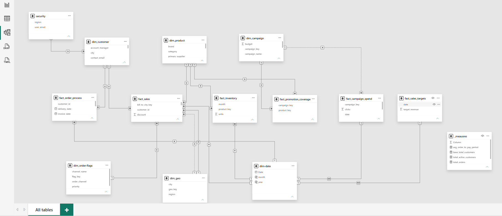

# 🧩 Multi-Domain Power BI Data Model

### 22 disconnected files → one governed analytical model.

<p align="center">
  
</p>

A Power BI data modeling project focused on transforming fragmented operational data into a structured, scalable, and governed analytical model.

The model brings together **Sales, Inventory, Marketing, Fulfillment, Targets, Customers, Products, and Geography** into a centralized semantic layer designed to support consistent KPIs, cross-domain analysis, and controlled regional access.

---

## 🎯 The Problem

Operational data was fragmented across **22 flat files** covering different business processes and entities.

Using disconnected files or a traditional "one big table" approach creates several analytical problems:

- Duplicated business logic and inconsistent KPIs
- Complex and ambiguous relationships
- Repeated data across multiple tables
- Difficult cross-domain analysis
- Limited visibility into fulfillment processes
- Poor scalability as reporting requirements grow
- Increased risk when regional users access shared reports

The objective was to build a centralized analytical model that could support multiple business domains while maintaining **performance, consistency, and data governance**.

---

## 🏗️ The Solution

I designed a **multi-domain Star/Galaxy Schema** in Power BI that separates transactional data from descriptive business entities and establishes reusable dimensions across the model.

The resulting semantic model provides a foundation for analyzing multiple business processes without forcing them into a single wide table.

### Model Architecture

```text
                         MULTI-DOMAIN MODEL
                                │
          ┌─────────────────────┼─────────────────────┐
          │                     │                     │
        SALES                INVENTORY             MARKETING
          │                     │                     │
    fact_sales          fact_inventory       fact_campaign_spend
          │                     │             fact_promotion_coverage
          │                     │                     │
          └─────────────────────┬─────────────────────┘
                                │
                       CONFORMED DIMENSIONS
                                │
          ┌─────────────┬───────┼───────┬─────────────┐
          │             │       │       │             │
       Customer      Product   Date     Geo        Campaign
                                │
                                ↓
                         FULFILLMENT
                                │
                       fact_order_process
                                │
                                ↓
                       GOVERNED ANALYTICS
                                │
                           Dynamic RLS
```

---

## 🧱 Architecture Highlights

### Conformed Dimensions

Shared dimensions provide consistent filtering and analysis across multiple business processes:

- `dim_customer`
- `dim_product`
- `dim_geo`
- `dim_campaign`
- `dim_date`

This establishes a **single source of truth** for common analytical entities.

### Multiple Fact Tables

The model separates business processes into dedicated fact tables:

| Fact Table | Business Process |
|---|---|
| `fact_sales` | Sales transactions |
| `fact_inventory` | Inventory balances |
| `fact_order_process` | Order fulfillment lifecycle |
| `fact_promotion_coverage` | Campaign-product coverage |
| `fact_campaign_spend` | Marketing spend |
| `fact_sales_targets` | Sales targets |

### Accumulating Snapshot

`fact_order_process` captures the progression of an order through key milestones:

```text
Order → Invoice → Shipment → Delivery → Payment
```

This creates a foundation for measuring fulfillment lead times and identifying process bottlenecks.

### Bridge Table

`fact_promotion_coverage` handles the many-to-many relationship between campaigns and products through an explicit bridge structure.

### Junk Dimension

`dim_order_flags` consolidates low-cardinality order attributes such as channel, priority, and status-related flags.

### Centralized Measures

The `_measures` table provides a dedicated location for reusable business logic and KPI calculations.

---

## 🔐 Data Governance

The model includes dynamic **Row-Level Security (RLS)** using a dedicated security mapping table.

```text
Authenticated User
        ↓
USERPRINCIPALNAME()
        ↓
Security Mapping
        ↓
Assigned Region
        ↓
Authorized Data
```

This allows a single centralized model to serve multiple regional stakeholders while restricting access to the appropriate business data.

---

## ⚙️ Data Preparation

Power Query was used to prepare and standardize the source data before loading it into the analytical model.

Key transformation activities included:

- Data cleaning
- Data type standardization
- Deduplication
- Normalization
- Unpivoting
- Surrogate key generation
- Data preparation for dimensional modeling

DAX was then used to create reusable analytical calculations and business logic.

---

## 📊 Business Value

The model creates a foundation for answering cross-functional business questions such as:

**Sales**
- How are sales performing across regions and products?
- How does actual revenue compare with targets?

**Inventory**
- What inventory is available across products and regions?
- How can inventory be analyzed alongside sales activity?

**Marketing**
- Which products are covered by campaigns?
- How does campaign activity relate to business performance?

**Fulfillment**
- How long does an order take to move through each milestone?
- Where are the largest fulfillment delays?

**Governance**
- Which regional users should have access to specific business data?

---

## 🧠 Key Outcomes

### Single Source of Truth

Shared dimensions and centralized measures reduce duplicated logic and inconsistent KPI definitions.

### Cross-Domain Analysis

Sales, inventory, marketing, and fulfillment can be analyzed through one semantic model.

### Supply Chain Visibility

The order-process structure provides a foundation for measuring lead times across fulfillment milestones.

### Scalable Reporting

Separating facts from dimensions creates an architecture that can be extended as analytical requirements evolve.

### Automated Data Governance

Dynamic RLS allows regional access to be managed centrally rather than maintaining separate report copies.

---

## 🛠️ Technical Stack

| Area | Technologies |
|---|---|
| Business Intelligence | Power BI Desktop |
| Data Preparation | Power Query, M |
| Data Modeling | Star Schema, Galaxy Schema, Dimensional Modeling |
| Analytics | DAX, Time Intelligence, KPI Development |
| Governance | Row-Level Security, `USERPRINCIPALNAME()` |

---

## 📚 Documentation

The repository includes additional documentation explaining the project in more detail:

- **[Methodology](documentation/methodology.md)** — modeling approach, architecture, transformations, relationships, RLS, validation, and optimization.
- **[Data Source & Attribution](documentation/data-source.md)** — source information and attribution.

---

## 📁 Repository Structure

```text
powerbi-multi-domain-data-model/
│
├── README.md
│
├── assets/
│   └── project-preview.png
│
└── documentation/
    ├── methodology.md
    └── data-source.md
```

---

## 👤 About Me

I'm **Omar Alkhulaidi**, a Data Analyst focused on **Business & Operations Analytics**.

I build practical analytics solutions that turn operational data into structured models, reliable KPIs, and clearer business decisions.

My areas of interest include:

`Business Intelligence` · `Data Analytics` · `Operations Analytics` · `Supply Chain Analytics` · `Data Modeling`

### Connect

[](https://www.linkedin.com/in/omar-alkhulaidi/)

[](https://github.com/Omar-Alkhulaidi)
